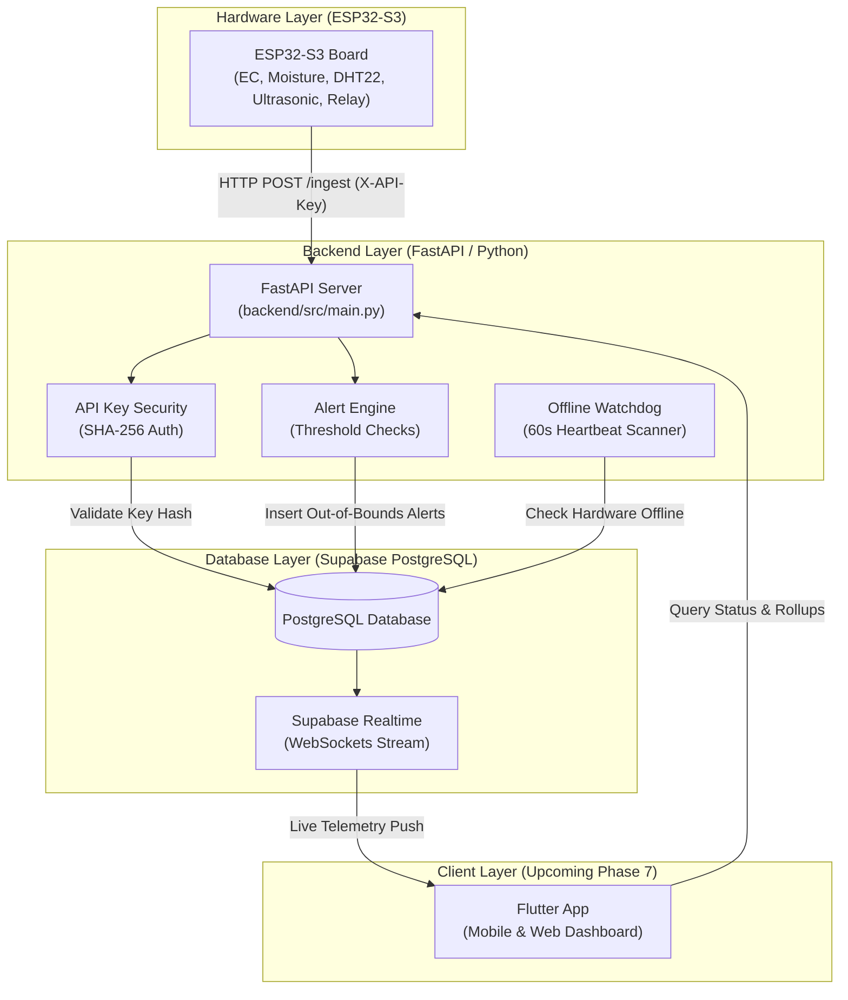

# 🏗️ HAT System Architecture (Beginner Friendly Overview)

The **HAT (Hydroponics Automation & Telemetry)** system connects hardware sensors in a hydroponic setup to a secure cloud database and backend server, preparing data for real-time display on user screens.

---

## 1. High-Level System Architecture Diagram

---

## 2. Component Responsibility Breakdown

| Layer | Files | Main Responsibilities |
| :--- | :--- | :--- |
| **Hardware Layer** | `firmware/src/main.cpp` `firmware/platformio.ini` | • Reads physical sensors (EC, Moisture, DHT22, Ultrasonic). • Connects to Wi-Fi (`UCP`). • POSTs JSON data every 30 sec with API key. • Buffers up to 10 readings offline if connection drops. |
| **Security Layer** | `backend/src/security.py` | • Checks `X-API-Key` using SHA-256 hash. • Verifies device ID & active status before allowing data. |
| **Backend Service** | `backend/src/main.py` `backend/src/schemas.py` | • Provides API endpoints (`/health`, `/ingest`, `/alerts`, `/status`, `/telemetry/hourly`). • Validates JSON payloads. |
| **Alert Engine** | `backend/src/services/alert_service.py` | • Evaluates pH & Temperature bounds. • Creates alert entries in database when thresholds fail. |
| **Watchdog Worker** | `backend/src/services/watchdog_service.py` | • Runs in background every 60 seconds. • Creates a "Device Offline" alert if no data is received for 5+ minutes. |
| **Database Layer** | `supabase/migrations/` | • Multi-tenant PostgreSQL database. • Stores devices, sensor readings, alerts, and hourly rollups view. • Realtime updates via WebSockets. |
| **Client Layer (Phase 7)** | `client/` *(Upcoming)* | • Cross-platform Flutter mobile & web app for live gauges, charts, and remote relay toggles. |

---

## 3. Data Flow Step-by-Step

### 1. Ingestion Flow (Every 30 Seconds)
1. **ESP32-S3** reads physical sensors (EC, Moisture, DHT22, Ultrasonic).
2. ESP32 packages data into JSON and sends HTTP POST to `http://10.9.26.152:8000/ingest` with `X-API-Key`.
3. Backend hashes API key with SHA-256 and verifies device in Supabase.
4. Backend inserts sensor readings into `sensor_readings` table and updates `devices.last_seen`.
5. Alert service checks if readings exceed thresholds and inserts any alerts.
6. Supabase Realtime pushes live update to subscriber dashboards.

### 2. Watchdog Flow (Every 60 Seconds)
1. Server background worker scans all active devices.
2. If `last_seen` is older than 5 minutes, it creates an offline alert.
3. Deduplication ensures only ONE active offline alert is raised per downtime period.
