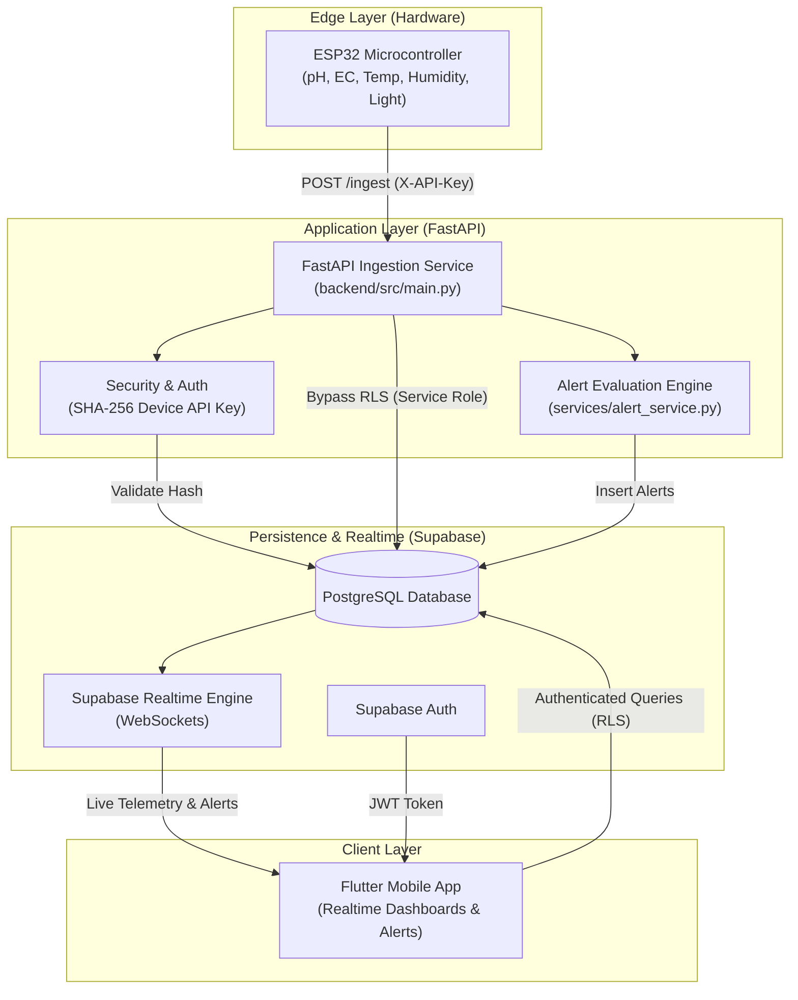
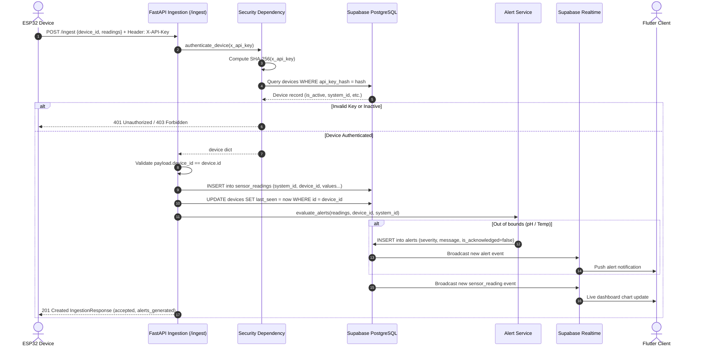

# HAT Architecture (Hydroponics Automation & Telemetry)

## 1. High-Level Architecture

The HAT platform is an end-to-end IoT monitoring and alerting ecosystem designed for precision hydroponic farming. It connects physical sensor microcontrollers (ESP32) to an asynchronous FastAPI backend service, persists telemetry into a multi-tenant PostgreSQL database via Supabase, evaluates real-time alert conditions, and streams live telemetry to client applications (Flutter).



---

## 2. Component Directory Structure

```
c:\HAT\
├── Progress/
│   ├── architecture.md           # This document (System architecture & data flows)
│   ├── current_state.md          # In-depth breakdown of current program cognition & capabilities
│   └── dot.md                    # Project progress log, milestone matrix & roadmap
├── backend/
│   ├── .env                      # Local environment configuration (Supabase keys & thresholds)
│   ├── pyproject.toml            # Project dependencies and pytest configuration
│   ├── uv.lock                   # Deterministic package dependency lockfile
│   ├── src/
│   │   ├── __init__.py
│   │   ├── config.py             # 12-factor configuration via pydantic-settings
│   │   ├── database.py           # Supabase client singleton (service-role privilege)
│   │   ├── main.py               # FastAPI entry point (/health, /ingest endpoints & lifespan)
│   │   ├── schemas.py            # Pydantic v2 telemetry request & response schemas
│   │   ├── security.py           # Device header auth (X-API-Key SHA-256 matching)
│   │   └── services/
│   │       ├── __init__.py
│   │       └── alert_service.py  # Rule evaluation & alert record generation
│   └── tests/
│       └── test_ingestion.py     # Automated unit & integration tests (FastAPI TestClient)
├── supabase/
│   ├── config.toml               # Supabase CLI and local stack configuration
│   └── migrations/
│       └── 20260907102838_initial_schema.sql  # Database tables, RLS, triggers & indexes
└── .env                          # Root environment variables
```

---

## 3. Subsystem Breakdown

### 3.1. Ingestion Backend Service (`backend/src/`)

Built with **FastAPI** for high-throughput, asynchronous sensor telemetry processing:

1. **Application Lifecycle & Health (`main.py`)**:
   - `lifespan`: Validates database connectivity with Supabase upon startup using a warm-up query to the `devices` table.
   - `GET /health`: Liveness probe returning `{ "status": "ok", "timestamp": "..." }`.
   - `POST /ingest`: Protected ingestion endpoint for device sensor batches.

2. **Security & Device Authentication (`security.py`)**:
   - Hardware devices transmit a raw secret key in the `X-API-Key` HTTP header.
   - The backend hashes this key using SHA-256 (`hashlib.sha256(raw_key.encode()).hexdigest()`).
   - The hash is queried against `devices.api_key_hash`.
   - Validates that `devices.is_active` is `true`. Deactivated devices receive `403 Forbidden`. Invalid keys receive `401 Unauthorized`.

3. **Data Validation & Resilience (`schemas.py`)**:
   - All individual sensor probes in `SensorReadings` are typed as `float | None`. This design ensures intermittent probe disconnections (e.g., pH probe unplugged) do not cause validation failure or block other working sensors.
   - `timestamp` defaults to timezone-aware UTC now (`datetime.now(timezone.utc)`) if not explicitly provided by edge hardware.
   - Strict cross-check: The `device_id` in the JSON body must match the authenticated device from the API key; otherwise, `400 Bad Request` is raised.

4. **Alert Evaluation Service (`services/alert_service.py`)**:
   - Analyzes persisted readings against configured environmental thresholds.
   - Evaluates:
     - **pH**: Critical alerts if `pH < ALERT_PH_MIN` (5.5) or `pH > ALERT_PH_MAX` (6.5).
     - **Water Temperature**: Warning alerts if `temp > ALERT_WATER_TEMP_MAX` (26.0°C) or `temp < ALERT_WATER_TEMP_MIN` (16.0°C).
   - Generates unacknowledged alert rows with severity, timestamps, and system/device identifiers, and commits them to the `alerts` table.

5. **Configuration Management (`config.py`)**:
   - Implements 12-factor configuration via `pydantic-settings`.
   - Reads from `backend/.env` with real environment variable overrides.
   - Stores alert limits and device health intervals (`DEVICE_OFFLINE_THRESHOLD_MINUTES = 5`).

---

### 3.2. Data & Persistence Layer (`supabase/`)

Supabase PostgreSQL is the primary store with strict multi-tenancy and role-based access control:

| Table | Primary Key | Purpose |
|---|---|---|
| `profiles` | `UUID` (references `auth.users`) | User metadata (syncs automatically via auth trigger `on_auth_user_created`). |
| `hydroponic_systems` | `UUID` | Individual hydroponic units/installations. |
| `system_members` | `UUID` | Multi-tenant access mapping users to systems with roles (`owner`, `operator`, `viewer`). |
| `devices` | `TEXT` (e.g., `ESP32_01`) | Hardware device registry, storing `api_key_hash`, `system_id`, `is_active`, and `last_seen`. |
| `sensor_readings` | `BIGINT` (Identity) | Wide-format time-series sensor telemetry data. |
| `alerts` | `UUID` | System and device alert events with severity and acknowledgement state. |

#### Access Control & RLS Policies
- **Row-Level Security (RLS)** is enabled on all tables.
- Function `public.has_system_access(_system_id UUID)` checks whether the authenticated user (`auth.uid()`) is enrolled in `system_members`.
- **Write-protection on `sensor_readings`**: Client users cannot insert readings directly (`WITH CHECK (false)`). Readings must flow through the FastAPI backend, which uses `SUPABASE_SERVICE_ROLE_KEY` to bypass client RLS.
- **Realtime Broadcast**: Tables `sensor_readings` and `alerts` are added to the `supabase_realtime` publication for push updates to connected Flutter clients.

#### Database Indexes
- `idx_sensor_readings_system_time`: Composite index on `(system_id, recorded_at DESC)` for fast historical charts and latest-reading queries.
- `idx_system_members_lookup`: Composite index on `(user_id, system_id)` for sub-millisecond RLS permission checks.
- `idx_alerts_unacknowledged`: Partial index on `(system_id) WHERE is_acknowledged = false` for rapid badge and alert-tray queries.

---

### 3.3. Test & Verification Layer (`backend/tests/`)

Automated testing framework orchestrated via **pytest** and **Starlette / FastAPI TestClient**:

1. **Configuration (`pyproject.toml`)**:
   - Manages dependencies using `uv`.
   - Defines `tool.pytest.ini_options` with `pythonpath = ["."]`, allowing direct imports from `src.*`.
   - Development dependencies include `pytest>=9.1.1` and `httpx>=0.28.1`.

2. **Ingestion & Security Verification (`tests/test_ingestion.py`)**:
   - `test_health_endpoint`: Asserts that `GET /health` returns HTTP 200 with status `"ok"` and a timestamp.
   - `test_ingest_missing_api_key`: Asserts that requests lacking an `X-API-Key` header are rejected with HTTP 401.
   - `test_ingest_invalid_api_key`: Asserts that forged or invalid API keys are rejected with HTTP 401.
   - `test_ingest_device_id_mismatch`: Asserts that an authenticated device cannot submit readings on behalf of a different `device_id` (returns HTTP 400).
   - `test_ingest_partial_probes_tolerated`: Asserts that sparse payloads (where some sensor values are `None` or omitted) succeed with HTTP 201 Created and `status: "accepted"`.
   - `test_ingest_threshold_alert_generation`: Asserts that submitting biochemical values outside acceptable bounds (e.g., pH 4.5 and water temp 28.0°C) triggers alert generation (`alerts_generated >= 2`) and persists alerts to the database.

---

## 4. End-to-End Ingestion Data Flow



---

## 5. Security & Isolation Model

1. **Hardware Authentication**: Edge devices never communicate using database passwords or JWT tokens. They use single-purpose, cryptographically hashed API keys (`devices.api_key_hash`). Even if the database is read, the original device keys cannot be reversed.
2. **Tenant Isolation**: Users only see data from systems to which they have explicitly been granted membership (`public.has_system_access()`).
3. **Data Integrity**: Edge devices cannot forge readings for other systems or other device IDs. The backend validates device ownership against the database registry before writing.
4. **Backend Privilege Separation**: The backend operates as a trusted service worker via the Supabase Service Role key, while mobile clients operate under restricted Row-Level Security via user JWTs.
