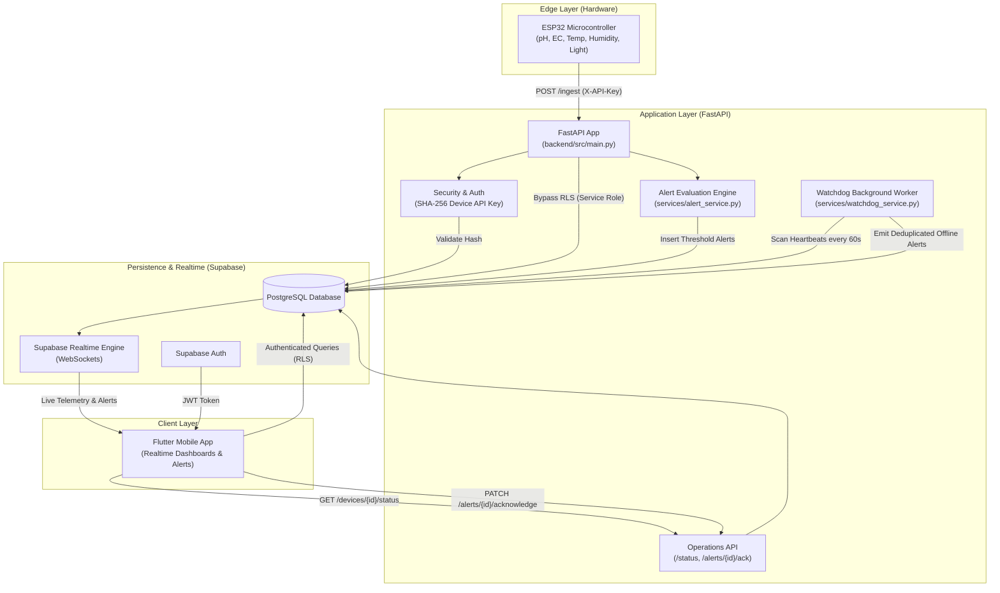
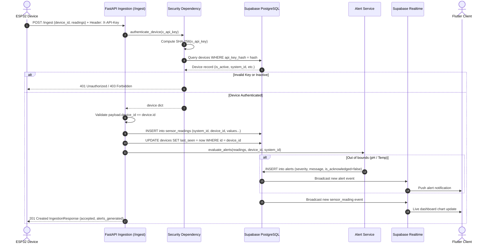
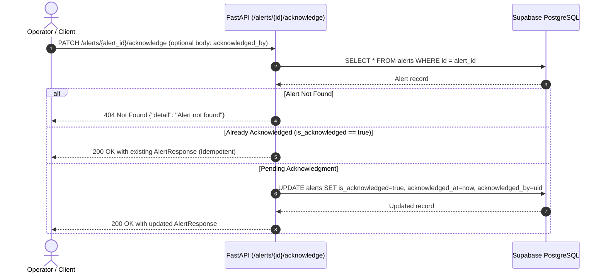
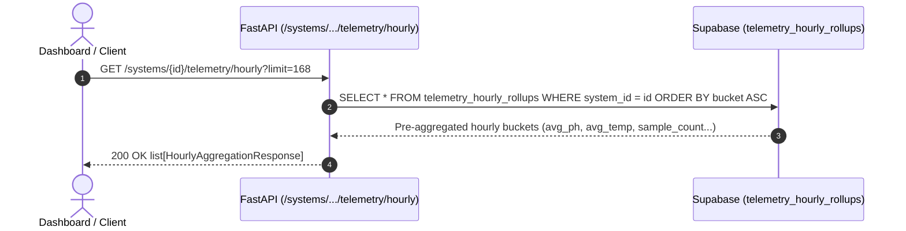

# HAT Architecture (Hydroponics Automation & Telemetry)

## 1. High-Level Architecture

The HAT platform is an end-to-end IoT monitoring and alerting ecosystem designed for precision hydroponic farming. It connects physical sensor microcontrollers (ESP32) to an asynchronous FastAPI backend service, persists telemetry into a multi-tenant PostgreSQL database via Supabase, evaluates real-time alert conditions, runs continuous background watchdogs to detect offline hardware, and streams live updates to client applications (Flutter).



---

## 2. Component Directory Structure

```
c:\HAT\
├── .env                                            # Root environment variables
├── .gitignore                                      # Git ignore rules
├── Progress/
│   ├── architecture.md                             # Architecture, component breakdown & data flows
│   ├── current_state.md                            # Capabilities, file inventory & active gaps
│   └── dot.md                                      # Milestone progress tracker & roadmap
├── backend/
│   ├── .env                                        # Local backend configuration (Supabase keys & thresholds)
│   ├── pyproject.toml                              # Project configuration & pytest options (uv managed)
│   ├── uv.lock                                     # Deterministic dependency lockfile
│   ├── src/
│   │   ├── __init__.py
│   │   ├── config.py                               # Settings & threshold limits via pydantic-settings
│   │   ├── database.py                             # Supabase client singleton (service_role bypass)
│   │   ├── main.py                                 # FastAPI app (6 endpoints) + watchdog lifespan loop
│   │   ├── schemas.py                              # Pydantic v2 schemas (telemetry, devices, alerts, rollups)
│   │   ├── security.py                             # X-API-Key validation via constant-time SHA-256
│   │   └── services/
│   │       ├── __init__.py
│   │       ├── alert_service.py                    # Threshold evaluation (pH & water temperature)
│   │       └── watchdog_service.py                 # Offline node detector & alert deduplication
│   └── tests/
│       ├── test_ingestion.py                       # Ingestion & auth test suite (6 tests)
│       ├── test_operations.py                      # Device status & alert ack test suite (6 tests)
│       └── test_queries.py                         # Alert filtering & hourly rollup test suite (3 tests)
└── supabase/
    ├── config.toml                                 # Supabase local stack configuration
    └── migrations/
        ├── 20260907102838_initial_schema.sql       # Tables, RLS, user sync trigger & composite indexes
        ├── 20260909102900_telemetry_rollups.sql    # Hourly aggregation view (telemetry_hourly_rollups)
        └── 20260909103319_telemtry_rollups.sql     # Remote-deployed telemetry rollups migration
```

---

## 3. Subsystem Breakdown

### 3.1. Ingestion & Operations Backend (`backend/src/`)

Built with **FastAPI** for high-throughput, asynchronous telemetry processing and device operations:

1. **Application Lifecycle & Background Tasks (`main.py`)**:
   - `lifespan`: Eagerly initializes the Supabase client and verifies database connectivity with `devices.select("id").limit(1)`.
   - **Watchdog Background Task**: Launches an `asyncio.create_task(_watchdog_loop())` running `check_device_heartbeats()` every 60 seconds. Catches `asyncio.CancelledError` on server shutdown for graceful termination.

2. **Endpoints**:
   - `GET /health`: Liveness probe returning `{ "status": "ok", "timestamp": ... }`.
   - `POST /ingest`: Authenticates hardware, persists readings to `sensor_readings`, updates `devices.last_seen`, triggers alert evaluation, and returns `IngestionResponse`.
   - `GET /devices/{device_id}/status`: Computes current status (`"online"` or `"offline"`) and elapsed time (`minutes_since_last_seen`) by comparing `devices.last_seen` against `DEVICE_OFFLINE_THRESHOLD_MINUTES` (5 mins). Returns HTTP 404 if device is unknown.
   - `PATCH /alerts/{alert_id}/acknowledge`: Marks an alert as resolved (`is_acknowledged = true`, `acknowledged_at = now`). Idempotent: if already acknowledged, returns the record unchanged without updating timestamps. Accepts optional `acknowledged_by` user UUID. Returns HTTP 404 if alert is unknown.
   - `GET /alerts`: Server-side filtered query for alerts by `system_id` (required), optional `is_acknowledged`, optional `severity`, `limit` (max 100), and `offset`. Uses PostgREST `count="exact"` for true pagination total. Returns `AlertListResponse`.
   - `GET /systems/{system_id}/telemetry/hourly`: Queries `telemetry_hourly_rollups` view for downsampled sensor averages (`avg_ph`, `avg_ec`, `avg_water_temp`, `avg_water_level`, `avg_air_temp`, `avg_humidity`, `avg_light_intensity`, `sample_count`) over a selectable time range. Returns `list[HourlyAggregationResponse]`.

3. **Security & Device Authentication (`security.py`)**:
   - Receives `X-API-Key` HTTP header.
   - Computes SHA-256 digest (`hashlib.sha256(raw_key.encode()).hexdigest()`).
   - Compares with stored digest in `devices.api_key_hash` using constant-time comparison (`hmac.compare_digest`).
   - Validates `devices.is_active` (`403 Forbidden` if false; `401 Unauthorized` if invalid key or missing header).

4. **Data Models & Validation (`schemas.py`)**:
   - `SensorReadings`: Wide-format sensor probe readings where each field is `float | None` to tolerate hardware probe disconnections.
   - `SensorPayload`: Encapsulates `device_id`, UTC-defaulted `timestamp`, and `SensorReadings`.
   - `DeviceStatusResponse`: Exposes `device_id`, `system_id`, `name`, `is_active`, `status` (`Literal["online", "offline"]`), `last_seen`, and `minutes_since_last_seen`.
   - `AlertAcknowledgeRequest`: Optional `acknowledged_by` (UUID).
   - `AlertResponse`: Complete alert model matching database row structure.
   - `IngestionResponse` & `HealthResponse`: Deterministic API responses.

5. **Alert Evaluation Service (`services/alert_service.py`)**:
   - Evaluates sensor values against environmental safety thresholds:
     - **pH**: Critical alert if $\text{pH} < 5.5$ or $\text{pH} > 6.5$.
     - **Water Temperature**: Warning alert if $\text{Temp} > 26.0^\circ\text{C}$ or $\text{Temp} < 16.0^\circ\text{C}$.
   - Unhandled evaluation exceptions are logged and non-blocking.

6. **Device Offline Watchdog Service (`services/watchdog_service.py`)**:
   - `check_device_heartbeats() -> int`:
     1. Fetches all active devices (`is_active = true`).
     2. Identifies devices with stale `last_seen` ($> 5$ minutes) or `None`.
     3. Checks `alerts` table for existing unacknowledged offline alerts matching `like("message", "%stopped reporting%")`.
     4. If an active alert already exists, skips insertion (deduplication).
     5. If no active alert exists, inserts a new `critical` alert and increments the counter.

7. **Configuration Management (`config.py`)**:
   - Singleton `Settings` loaded via `pydantic-settings` from `.env`.
   - Exposes database credentials, threshold parameters, and `DEVICE_OFFLINE_THRESHOLD_MINUTES = 5`.

---

### 3.2. Data & Persistence Layer (`supabase/`)

Supabase PostgreSQL is the primary store with strict multi-tenancy and role-based access control:

| Table | Primary Key | Purpose |
|---|---|---|
| `profiles` | `UUID` (references `auth.users`) | User metadata (syncs automatically via auth trigger `on_auth_user_created`). |
| `hydroponic_systems` | `UUID` | Individual hydroponic units/installations. |
| `system_members` | `UUID` | Multi-tenant access mapping users to systems with roles (`owner`, `operator`, `viewer`). |
| `devices` | `TEXT` (e.g., `ESP32_01`) | Hardware device registry, storing `api_key_hash`, `system_id`, `is_active`, and `last_seen`. |
| `sensor_readings` | `BIGINT` (Identity) | Wide-format time-series sensor telemetry data. |
| `alerts` | `UUID` | System and device alert events with severity and acknowledgement state. |

#### Access Control & RLS Policies
- **Row-Level Security (RLS)** is enabled on all tables.
- Function `public.has_system_access(_system_id UUID)` checks whether the authenticated user (`auth.uid()`) is enrolled in `system_members`.
- **Write-protection on `sensor_readings`**: Client users cannot insert readings directly (`WITH CHECK (false)`). Readings must flow through the FastAPI backend, which uses `SUPABASE_SERVICE_ROLE_KEY` to bypass client RLS.
- **Realtime Broadcast**: Tables `sensor_readings` and `alerts` are added to the `supabase_realtime` publication for push updates to connected Flutter clients.

#### Database Indexes
- `idx_sensor_readings_system_time`: Composite index on `(system_id, recorded_at DESC)` for fast historical charts and latest-reading queries.
- `idx_system_members_lookup`: Composite index on `(user_id, system_id)` for sub-millisecond RLS permission checks.
- `idx_alerts_unacknowledged`: Partial index on `(system_id) WHERE is_acknowledged = false` for rapid badge and alert-tray queries.

---

### 3.3. Test & Verification Layer (`backend/tests/`)

Automated testing framework orchestrated via **pytest** and **Starlette / FastAPI TestClient**:

1. **Configuration (`pyproject.toml`)**:
   - Manages dependencies using `uv`.
   - Defines `tool.pytest.ini_options` with `pythonpath = ["."]`, allowing direct imports from `src.*`.

2. **Ingestion & Security Verification (`tests/test_ingestion.py`)**:
   - `test_health_endpoint`: Asserts that `GET /health` returns HTTP 200 with status `"ok"` and a timestamp.
   - `test_ingest_missing_api_key`: Asserts that requests lacking an `X-API-Key` header are rejected with HTTP 401.
   - `test_ingest_invalid_api_key`: Asserts that forged or invalid API keys are rejected with HTTP 401.
   - `test_ingest_device_id_mismatch`: Asserts that an authenticated device cannot submit readings on behalf of a different `device_id` (returns HTTP 400).
   - `test_ingest_partial_probes_tolerated`: Asserts that sparse payloads (where some sensor values are `None` or omitted) succeed with HTTP 201 Created and `status: "accepted"`.
   - `test_ingest_threshold_alert_generation`: Asserts that submitting biochemical values outside acceptable bounds (e.g., pH 4.5 and water temp 28.0°C) triggers alert generation (`alerts_generated >= 2`) and persists alerts to the database.

3. **Operations & Watchdog Verification (`tests/test_operations.py`)**:
   - `test_get_device_status_online`: Asserts that a device with recent `last_seen` reports status `"online"`.
   - `test_get_device_status_offline`: Asserts that a device with `last_seen` older than 5 minutes reports status `"offline"`.
   - `test_get_device_status_not_found`: Asserts that querying a non-existent device returns HTTP 404.
   - `test_acknowledge_alert_success`: Inserts an alert, sends `PATCH /alerts/{id}/acknowledge`, and asserts `is_acknowledged = True` and updated timestamp.
   - `test_acknowledge_alert_not_found`: Asserts that acknowledging a non-existent alert UUID returns HTTP 404.
   - `test_watchdog_detects_offline_device_and_deduplicates`: Sets a device to stale (15 mins ago), executes `check_device_heartbeats()` verifying 1 alert is created, then executes a second run verifying 0 alerts are created (deduplication confirmed).

4. **Query & Aggregation Verification (`tests/test_queries.py`)**:
   - `test_get_alerts_filtered`: Asserts that `GET /alerts` returns filtered results for a valid `system_id` and checks pagination schema.
   - `test_get_alerts_missing_system_id`: Asserts that omitting required `system_id` returns HTTP 422 Unprocessable Entity.
   - `test_get_hourly_telemetry_empty`: Asserts that `GET /systems/{id}/telemetry/hourly` returns a valid list conforming to `HourlyAggregationResponse`.

---

## 4. End-to-End Data Flows

### 4.1. Telemetry Ingestion Flow



### 4.2. Watchdog Heartbeat & Offline Alert Cycle

```mermaid
sequenceDiagram
    autonumber
    participant Loop as Watchdog Loop (Every 60s)
    participant Svc as watchdog_service.py
    participant DB as Supabase PostgreSQL
    participant RT as Supabase Realtime
    actor App as Flutter Client

    Loop->>Svc: check_device_heartbeats()
    Svc->>DB: SELECT * FROM devices WHERE is_active = true
    DB-->>Svc: Active devices list
    
    loop Each Device
        Svc->>Svc: Compare now_utc - last_seen against 5m threshold
        alt Device is Stale (> 5 min or None)
            Svc->>DB: SELECT id FROM alerts WHERE device_id = id AND is_acknowledged = false AND message LIKE '%stopped reporting%'
            DB-->>Svc: Existing unacknowledged offline alerts
            
            alt Existing Alert Found
                Svc->>Svc: Skip (Deduplication prevents flood)
            else No Active Alert
                Svc->>DB: INSERT into alerts (severity="critical", message="Device ... stopped reporting")
                DB->>RT: Broadcast critical alert
                RT->>App: Push offline device notification
            end
        end
    end
```

### 4.3. Alert Acknowledgment Flow



### 4.4. Telemetry Downsampling & Query Flow



---

## 5. Security & Isolation Model

1. **Hardware Authentication**: Edge devices never communicate using database passwords or JWT tokens. They use single-purpose, cryptographically hashed API keys (`devices.api_key_hash`). Even if the database is read, the original device keys cannot be reversed.
2. **Tenant Isolation**: Users only see data from systems to which they have explicitly been granted membership (`public.has_system_access()`).
3. **Data Integrity**: Edge devices cannot forge readings for other systems or other device IDs. The backend validates device ownership against the database registry before writing.
4. **Backend Privilege Separation**: The backend operates as a trusted service worker via the Supabase Service Role key, while mobile clients operate under restricted Row-Level Security via user JWTs.
5. **Worker Resiliency & Resource Guarding**: Background watchdog tasks run cooperatively within the event loop, handle cancellation signals on shutdown, and apply query-level deduplication to prevent database bloating.
